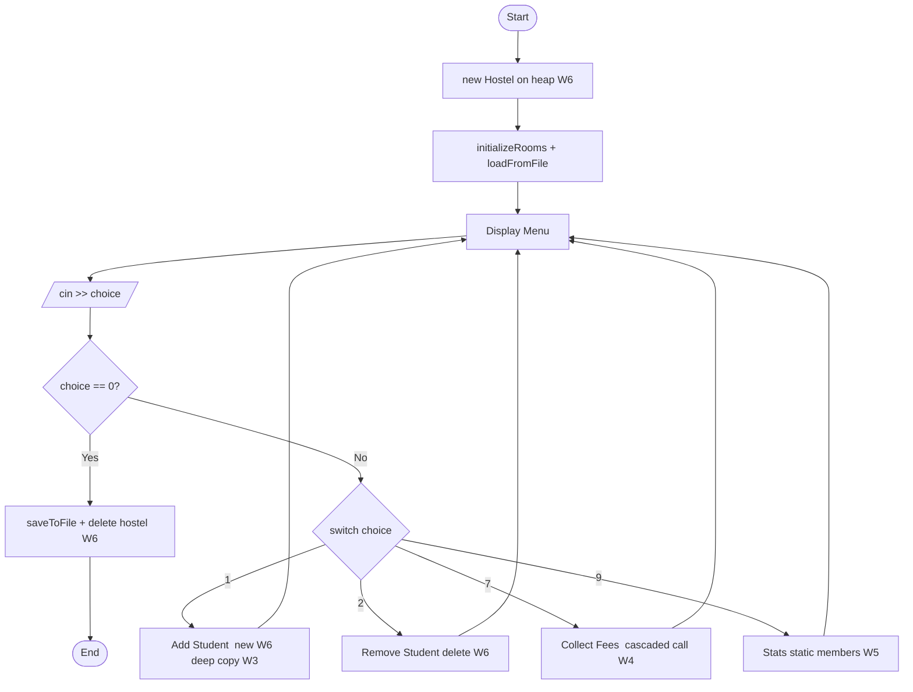

# 🏠 Hostel Management System (HMS)

> A single-file C++ console application demonstrating all core Object-Oriented Programming concepts taught in Weeks 1–7, including file persistence, operator overloading, deep copy semantics, dynamic memory management, and more.

---

## 📋 Table of Contents

- [Project Overview](#-project-overview)
- [OOP Concepts Coverage](#-oop-concepts-coverage-week-by-week)
- [Class Architecture](#-class-architecture)
- [Program Flow](#-program-flow)
- [Features](#-features)
- [How to Compile & Run](#-how-to-compile--run)
- [File Structure](#-file-structure)
- [Diagrams](#-diagrams)
- [Sample Usage](#-sample-usage)

---

## 🎯 Project Overview

The **Hostel Management System** manages students, rooms, and fee records for a hostel. All data is persisted to a text file (`hostel_data.txt`) and reloaded on startup. The entire project lives in a **single `main.cpp` file** and covers every OOP topic from the course curriculum.

```
Language  : C++
File      : main.cpp  (single file)
Data file : hostel_data.txt  (auto-created)
Compiler  : g++ (GCC) — any C++11 or later
```

---

## 📚 OOP Concepts Coverage (Week by Week)

| Week | Topic | Where in Code |
|------|-------|---------------|
| **W1** | Encapsulation, Abstraction, OOP vs structured | All `private` fields in `Date`, `Room`, `Student`, `Hostel` |
| **W2** | Classes & Objects, default/copy ctor, destructor, `=`, `&`, `public`/`private` | All four classes implement the full set of special members |
| **W3** | Programmer-defined ctor, overloading, shallow vs deep copy, initializer list | `Student(const Student&)` deep-copies `char* name` via `new`; initializer lists in every constructor |
| **W4** | Separate declaration & definition, accessors, objects as arg/return, cascaded calls | `getRoom() : Room`, `getJoinDate() : Date`; `payFees().updateContact()` chain |
| **W5** | Static members, `const` members, object members, `this` pointer | `static int studentCount`, `const string dataFile`, `Room room` inside `Student`, `return *this` |
| **W6** | Arrow `->` operator, `new` / `delete` for heap objects | `students = new Student*[max]`, `students[i]->getId()`, `delete students[i]` |
| **W7** | Operator overloading (member & friend), friend restrictions | `operator==`, `operator=`, `operator<<` as `friend` in all classes |
| **File I/O** | Text file handling | `saveToFile()` with `ofstream`, `loadFromFile()` with `ifstream` |

---

## 🏗 Class Architecture

```
┌──────────────────────────────────────────────────────┐
│                        Hostel                        │
│  - students : Student**  (dynamic array, W6)         │
│  - rooms    : Room*      (dynamic array, W6)         │
│  - hostelCount : static  (W5)                        │
│  - dataFile    : const   (W5)                        │
│  + saveToFile() / loadFromFile()   (File I/O)        │
│  + operator<<  [friend]            (W7)              │
└───────────────┬──────────────────────────────────────┘
                │ manages (1 → 0..*)
                ▼
┌───────────────────────────────────────────────────────┐
│                       Student                         │
│  - name         : char*   ← deep copy (W3)            │
│  - room         : Room    ← object member (W5)        │
│  - joinDate     : Date    ← object member (W5)        │
│  - studentCount : static  (W5)                        │
│  + payFees() : Student&   ← cascaded calls (W4)       │
│  + operator<<  [friend]   (W7)                        │
└──────┬─────────────────────────────┬─────────────────┘
       │ has-a (object member)       │ has-a (object member)
       ▼                             ▼
┌─────────────────┐         ┌────────────────────┐
│      Room       │         │       Date         │
│ - totalRooms    │         │ - day/month/year   │
│   : static (W5) │         │ + operator<<       │
│ + operator==    │         │   [friend] (W7)    │
│ + operator<<    │         │ + operator==       │
│   [friend] (W7) │         │   (member)  (W7)  │
└─────────────────┘         └────────────────────┘
```

> **Full UML class diagram:** see `hostel_uml.puml`
> **Program flowchart:** see `hostel_flowchart.mmd`

---

## 🔄 Program Flow



> For the full detailed flowchart, open `hostel_flowchart.mmd` in [Mermaid Live Editor](https://mermaid.live).

---

## ✅ Features

- **Student Registration** — Add students with ID, name (dynamic `char*`), CNIC, contact, room, and join date
- **Room Management** — Pre-loaded rooms (Single / Double / Triple) with rent; add more at runtime
- **Fee Collection** — Pay and track fees per student with cascaded function calls
- **Search & Display** — Search by student ID; list all students or all / available rooms
- **Statistics** — Live counts via `static` members (`studentCount`, `totalRooms`, `hostelCount`)
- **File Persistence** — All records auto-saved to `hostel_data.txt` and reloaded on next run
- **Deep Memory Management** — `char* name` uses `new` / `delete[]`; full Rule-of-Three implemented

---

## ⚙️ How to Compile & Run

### Prerequisites
- GCC / G++ compiler (C++11 or later)
- Any terminal (Linux, macOS, Windows with MinGW or WSL)

### Compile

```bash
g++ -o hms main.cpp
```

### Run

```bash
# Linux / macOS
./hms

# Windows
hms.exe
```

### Menu Options

```
============================================
     HOSTEL MANAGEMENT SYSTEM
     Green Valley Hostel
============================================
 1.  Add Student
 2.  Remove Student
 3.  Search Student
 4.  Display All Students
 5.  Display All Rooms
 6.  Display Available Rooms
 7.  Collect Fees
 8.  Add Room
 9.  Display Statistics
 10. Save Data to File
 0.  Exit
============================================
```

---

## 📁 File Structure

```
hostel-management-system/
│
├── main.cpp                  ← Full C++ source (single file)
├── hostel_data.txt           ← Auto-generated data file (created on first save)
│
├── hostel_uml.puml           ← UML Class Diagram  (PlantUML format)
├── hostel_flowchart.mmd      ← Program Flowchart  (Mermaid format)
└── README.md                 ← This file
```

---

## 🖼 Diagrams

### UML Class Diagram (`hostel_uml.puml`)

Open with any of these tools:

| Tool | How to open |
|------|-------------|
| **VS Code** | Install *PlantUML* extension → open `.puml` → press `Alt + D` |
| **IntelliJ / CLion** | Install *PlantUML Integration* plugin → open `.puml` → preview panel |
| **Online** | Go to [plantuml.com/plantuml](https://www.plantuml.com/plantuml/uml/) → paste file contents |
| **PlantUML JAR** | `java -jar plantuml.jar hostel_uml.puml` → exports PNG/SVG |

### Flowchart (`hostel_flowchart.mmd`)

Open with any of these tools:

| Tool | How to open |
|------|-------------|
| **Mermaid Live Editor** | Go to [mermaid.live](https://mermaid.live) → paste file contents |
| **VS Code** | Install *Markdown Preview Mermaid Support* extension → preview renders automatically |
| **GitHub** | Push `.mmd` file and it renders natively in Markdown |
| **Obsidian** | Paste inside a code block tagged ` ```mermaid ` |
| **draw.io** | Extras → Edit Diagram → paste Mermaid syntax |

---

## 🧪 Sample Usage

```
Enter your choice: 1

--- Add New Student ---
Student ID    : 101
Full Name     : Ali Hassan
CNIC          : 35202-1234567-8
Contact No.   : 0300-1234567
Room Number   : 103
Join Date (DD MM YYYY): 15 1 2025

[+] Student registered successfully!
  [*] Data saved to 'hostel_data.txt'
```

```
Enter your choice: 7

Enter Student ID  : 101
Enter Fee Amount  : 5000

[+] PKR 5000 collected from Ali Hassan
    Total paid so far: PKR 5000
  [*] Data saved to 'hostel_data.txt'
```

---

## 🔑 Key OOP Highlights

```cpp
// W3 — Deep copy constructor (char* name)
Student::Student(const Student& s) {
    name = new char[strlen(s.name) + 1];
    strcpy(name, s.name);
}

// W4 — Cascaded calls (returns *this)
student->payFees(5000).updateContact("0321-9999999");

// W5 — Static member + this pointer
Student& Student::payFees(float amount) {
    totalFeesPaid += amount;
    return *this;               // implicit this pointer
}

// W6 — Arrow operator + new / delete
students[i] = new Student(id, name, cnic, contact, *r, date);
students[i]->display();         // -> operator
delete students[i];             // destructor auto-frees char* name

// W7 — Friend operator overloading
friend ostream& operator<<(ostream& out, const Student& s);
```

---

## 👨‍💻 Author

| Field | Details |
|-------|---------|
| **Name** | Maham Shahzadi |
| **Roll Number** | 2025-CS-693 |
| **Project** | Hostel Management System |
| **Language** | C++ |
| **Paradigm** | Object-Oriented Programming |
| **Curriculum** | Weeks 1–7 OOP Concepts |
