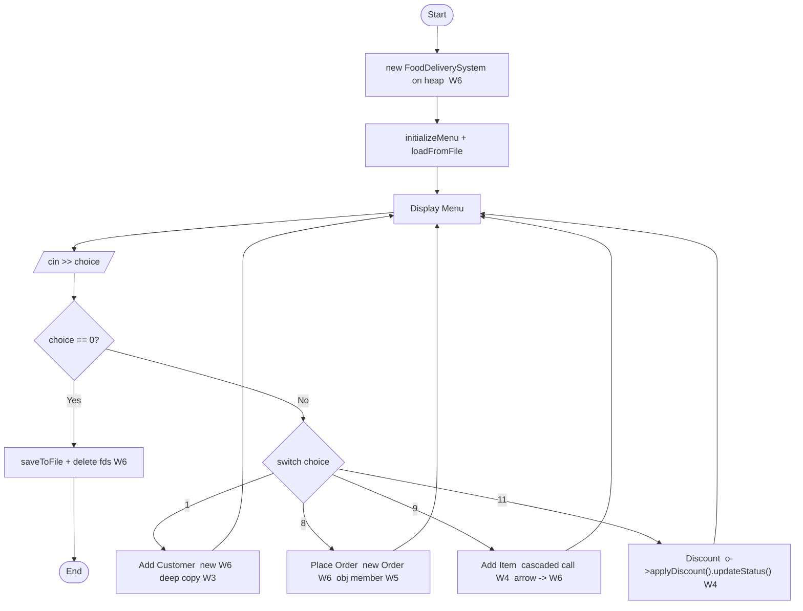

# 🍔 Food Delivery System (FDS)

> A single-file C++ console application demonstrating all core Object-Oriented Programming concepts from Weeks 1–7, featuring a complete food ordering pipeline with customers, menu management, order processing, discounts, and file persistence.

---

## 👨‍💻 Author

| Field | Details |
|-------|---------|
| **Name** | Maham Shahzadi |
| **Roll Number** | 2025-CS-693 |
| **Project** | Food Delivery System |
| **Language** | C++ |
| **Paradigm** | Object-Oriented Programming |
| **Curriculum** | Weeks 1–7 OOP Concepts |

---

## 📋 Table of Contents

- [Project Overview](#-project-overview)
- [OOP Concepts Coverage](#-oop-concepts-coverage-week-by-week)
- [Class Architecture](#-class-architecture)
- [Program Flow](#-program-flow)
- [Features](#-features)
- [How to Compile & Run](#-how-to-compile--run)
- [File Structure](#-file-structure)
- [Diagrams](#-diagrams)
- [Sample Usage](#-sample-usage)
- [Key OOP Highlights](#-key-oop-highlights)

---

## 🎯 Project Overview

The **Food Delivery System** simulates a real-world food ordering platform like Foodpanda or Uber Eats. It manages customers, a restaurant menu, and orders. All data is persisted to `orders_data.txt` and reloaded on startup. The entire project is in a **single `main.cpp` file** covering every OOP topic from the course curriculum.

```
Language  : C++
File      : main.cpp  (single file)
Data file : orders_data.txt  (auto-created)
Compiler  : g++ (GCC) — C++11 or later
```

---

## 📚 OOP Concepts Coverage (Week by Week)

| Week | Topic | Where in Code |
|------|-------|---------------|
| **W1** | Encapsulation, Abstraction, OOP vs structured | All `private` fields in `Date`, `MenuItem`, `Customer`, `Order`, `FoodDeliverySystem` |
| **W2** | Classes & Objects, default/copy ctor, destructor, `public`/`private` | All five classes implement the full set of special member functions |
| **W3** | Programmer-defined ctor, overloading, shallow vs deep copy, initializer list | `MenuItem`, `Customer`, `Order` all deep-copy `char*` via `new`; initializer lists everywhere |
| **W4** | Separate declaration & definition, accessors, objects as arg/return, cascaded calls | `getCustomer():Customer`, `getOrderDate():Date`; `o->addItem(x).updateStatus("Preparing")` |
| **W5** | Static members, `const` members, object members, `this` pointer | `static customerCount`, `static orderCount`, `const dataFile`, `Customer customer` inside `Order`, `return *this` |
| **W6** | Arrow `->` operator, `new` / `delete` | `customers = new Customer*[max]`, `customers[i]->getId()`, `delete customers[i]` |
| **W7** | Operator overloading (member & friend) | `operator==`, `operator=`, `operator<<` as `friend` in all classes |
| **File I/O** | Text file handling | `saveToFile()` with `ofstream`, `loadFromFile()` with `ifstream` |

---

## 🏗 Class Architecture

```
┌────────────────────────────────────────────────────────────────┐
│                    FoodDeliverySystem                          │
│  - customers  : Customer**  (dynamic ptr array, W6)           │
│  - orders     : Order**     (dynamic ptr array, W6)           │
│  - menu       : MenuItem*   (dynamic array, W6)               │
│  - systemCount : static     (W5)                              │
│  - dataFile    : const      (W5)                              │
│  + saveToFile() / loadFromFile()    (File I/O)                │
│  + operator<<  [friend]             (W7)                      │
└──────────┬───────────────────────┬─────────────────────────── ┘
           │ manages (1 → 0..*)    │ manages (1 → 0..*)
           ▼                       ▼
┌─────────────────────┐   ┌─────────────────────────────────────┐
│      Customer       │   │               Order                 │
│  - name  : char*    │   │  - customer  : Customer (W5 obj)    │
│    (deep copy W3)   │   │  - orderDate : Date     (W5 obj)    │
│  - customerCount    │   │  - items     : MenuItem* (W6 heap)  │
│    : static (W5)    │   │  - orderCount : static  (W5)        │
│  + addSpending()    │   │  + addItem()    ← cascaded (W4)     │
│    cascaded (W4)    │   │  + applyDiscount()                  │
│  + operator<<       │   │    .updateStatus() chain (W4)       │
│    [friend] (W7)    │   │  + operator<<   [friend] (W7)       │
└─────────────────────┘   └──────────────┬──────────────────────┘
                                         │ contains (object member)
                          ┌──────────────┴──────────────────────┐
                          │       Date            MenuItem       │
                          │  - day/month/year  - itemName:char*  │
                          │  + operator<<      - totalItems:stat │
                          │    [friend] (W7)   + operator<<      │
                          │  + operator==        [friend] (W7)  │
                          │    (member) (W7)   + operator==      │
                          └─────────────────────────────────────┘
```

> **Full UML class diagram:** `food_delivery_uml.puml`
> **Program flowchart:** `food_delivery_flowchart.mmd`

---

## 🔄 Program Flow



> For the full detailed flowchart, open `food_delivery_flowchart.mmd` in [Mermaid Live Editor](https://mermaid.live).

---

## ✅ Features

- **Customer Management** — Register / remove / search customers with ID, name (`char*`), contact, address
- **Menu Management** — 8 pre-loaded items; add more at runtime; filter available items
- **Order Placement** — Create orders linked to customers with a date
- **Item Addition** — Add multiple menu items per order; total auto-calculated
- **Order Status Tracking** — Update status: Pending → Preparing → Out for Delivery → Delivered
- **Discount System** — Apply percentage discounts with chained method calls (cascading, W4)
- **Customer Spending Tracker** — Tracks total amount spent per customer across all orders
- **Statistics Dashboard** — Live counts via `static` members
- **File Persistence** — Auto-save to `orders_data.txt`, reload on every startup

---

## ⚙️ How to Compile & Run

### Prerequisites

- GCC / G++ compiler (C++11 or later)
- Any terminal (Linux, macOS, Windows with MinGW or WSL)

### Compile

```bash
g++ -o fds main.cpp
```

### Run

```bash
# Linux / macOS
./fds

# Windows
fds.exe
```

### Menu Options

```
=============================================
       FOOD DELIVERY SYSTEM
       QuickBite Express
=============================================
 1.  Add Customer
 2.  Remove Customer
 3.  Search Customer
 4.  Display All Customers
 5.  Display Full Menu
 6.  Display Available Menu
 7.  Add Menu Item
 8.  Place Order
 9.  Add Item to Order
 10. Update Order Status
 11. Apply Discount to Order
 12. View Order
 13. Display All Orders
 14. Orders by Customer
 15. Display Statistics
 16. Save Data to File
 0.  Exit
=============================================
```

---

## 📁 File Structure

```
food-delivery-system/
│
├── main.cpp                      ← Full C++ source (single file)
├── orders_data.txt               ← Auto-generated data file
│
├── food_delivery_uml.puml        ← UML Class Diagram  (PlantUML)
├── food_delivery_flowchart.mmd   ← Program Flowchart  (Mermaid)
└── README.md                     ← This file
```

---

## 🖼 Diagrams

### UML Class Diagram — `food_delivery_uml.puml`

| Tool | How to open |
|------|-------------|
| **VS Code** | Install *PlantUML* extension → open `.puml` → press `Alt + D` |
| **IntelliJ / CLion** | Install *PlantUML Integration* plugin → open `.puml` → preview panel |
| **Online (fastest)** | Go to [plantuml.com/plantuml](https://www.plantuml.com/plantuml/uml/) → paste file contents |
| **Export PNG/SVG** | `java -jar plantuml.jar food_delivery_uml.puml` |

### Flowchart — `food_delivery_flowchart.mmd`

| Tool | How to open |
|------|-------------|
| **Mermaid Live (fastest)** | Go to [mermaid.live](https://mermaid.live) → paste file contents |
| **VS Code** | Install *Markdown Preview Mermaid Support* → wrap in ` ```mermaid ` block |
| **GitHub** | Renders natively inside any `.md` file |
| **draw.io** | Extras → Edit Diagram → paste Mermaid syntax |
| **Obsidian** | Paste inside ` ```mermaid ` code block |

---

## 🧪 Sample Usage

**Register a customer and place an order:**

```
Enter your choice: 1
--- Register Customer ---
Customer ID  : 201
Full Name    : Maham Shahzadi
Contact No.  : 0300-1111111
Address      : House 12, Street 5, Islamabad
[+] Customer registered!

Enter your choice: 8
--- Place Order ---
Order ID      : 1001
Customer ID   : 201
Order Date (DD MM YYYY): 30 3 2025
[+] Order placed! Now add items using option 9.

Enter your choice: 9
Order ID     : 1001
Menu Item ID : 1
[+] Zinger Burger added to Order #1001

Enter your choice: 11
Order ID     : 1001
Discount (%) : 10
[+] 10% discount applied to Order #1001
    New Total: PKR 315
```

---

## 🔑 Key OOP Highlights

```cpp
// W3 — Deep copy constructor (char* name in Customer)
Customer::Customer(const Customer& c) {
    name = new char[strlen(c.name) + 1];
    strcpy(name, c.name);
}

// W3 — Deep copy in Order (copies MenuItem array)
Order::Order(const Order& o) {
    items = new MenuItem[maxItems];
    for (int i = 0; i < itemCount; i++)
        items[i] = o.items[i];   // uses MenuItem::operator=
}

// W4 — Cascaded calls (each method returns *this)
order->addItem(item).updateStatus("Preparing");
customer->addSpending(350).updateAddress("New Address");

// W5 — Static members + this pointer
Order& Order::addItem(const MenuItem& item) {
    items[itemCount++] = item;
    totalAmount += item.getPrice();
    return *this;              // W5: this pointer enables cascading
}

// W6 — Arrow operator + new / delete
orders[i] = new Order(id, *customer, date);
orders[i]->display();         // -> operator
delete orders[i];             // destructor chain: ~Order → delete[] items
                              //                  ~MenuItem → delete[] itemName

// W7 — Friend operator overloading
friend ostream& operator<<(ostream& out, const Order& o);
friend ostream& operator<<(ostream& out, const Customer& c);
```
